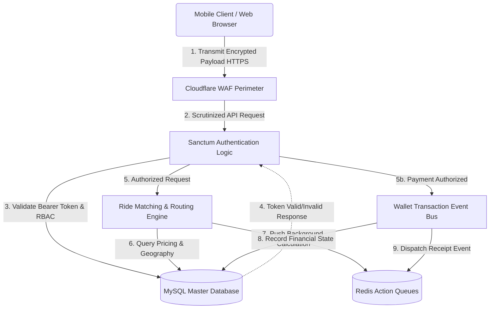
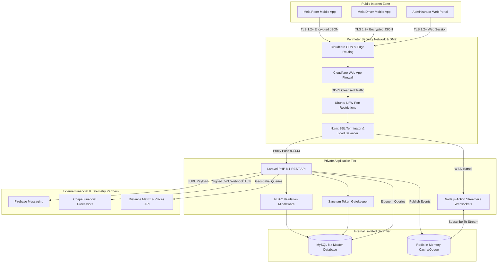
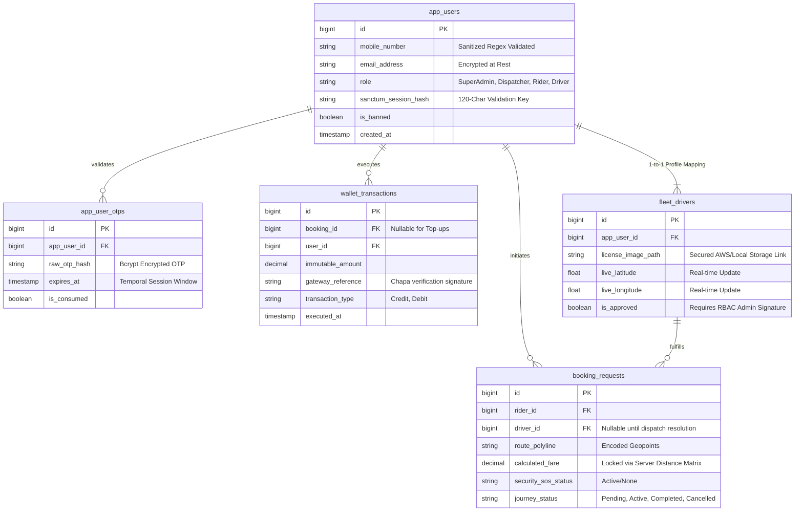

# Mela Guzo Web Application Diagrams

These comprehensive reference diagrams are constructed explicitly to satisfy the **5.1 Business Architecture and Design** requirements prescribed by the INSA Web Application Security Testing Assessment.

---

### 1. Data Flow Diagrams (DFD) 
*(Referenced within Section 5.1.1)*

#### Level 0: Context Data Flow Diagram
This indicates the high-level boundary interaction of the Mela Guzo platform with external actants.

#### Level 1: Detailed Data Flow Diagram
This elaborates on the internal data transformations occurring within the `Mela Guzo Core Backend System`.

---

### 2. System Architecture Diagram
*(Referenced within Section 5.1.2)*

This blueprint maps the network topology, emphasizing the security perimeter, application tiers, and third-party interactions.

---

### 3. Entity Relationship Diagram (ERD) - Core Security Models
*(Referenced within Section 5.1.3)*

This ERD specifically highlights fields scrutinized for security, PII isolation, and financial integrity. 

