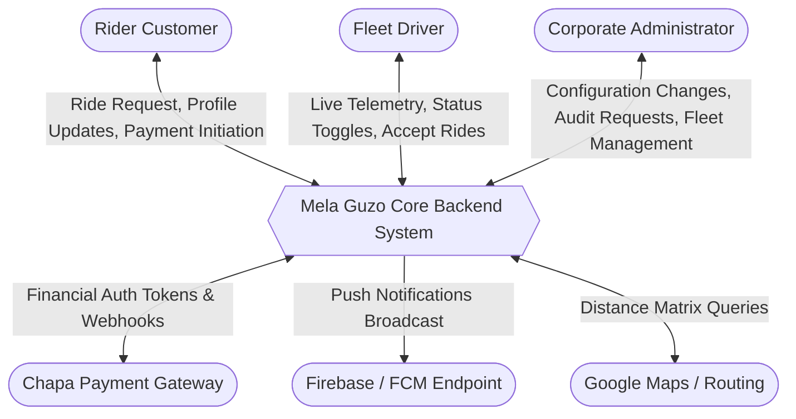
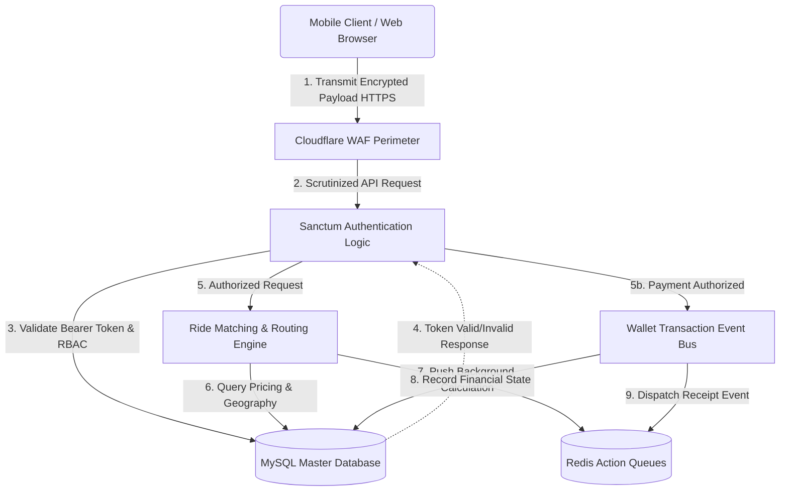
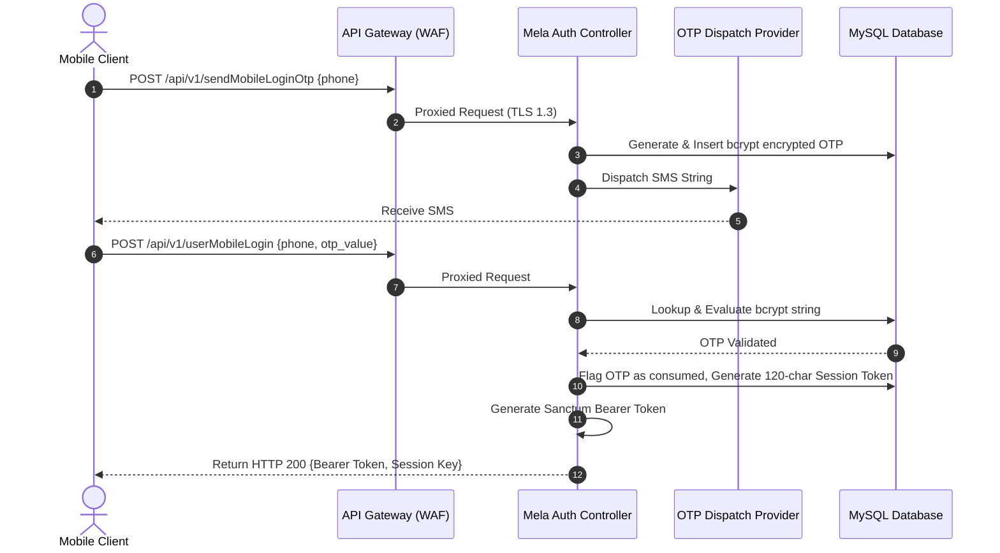
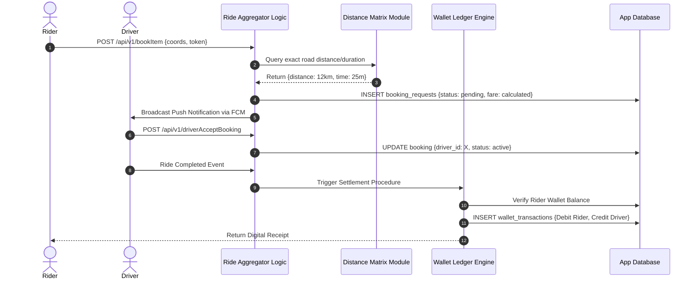
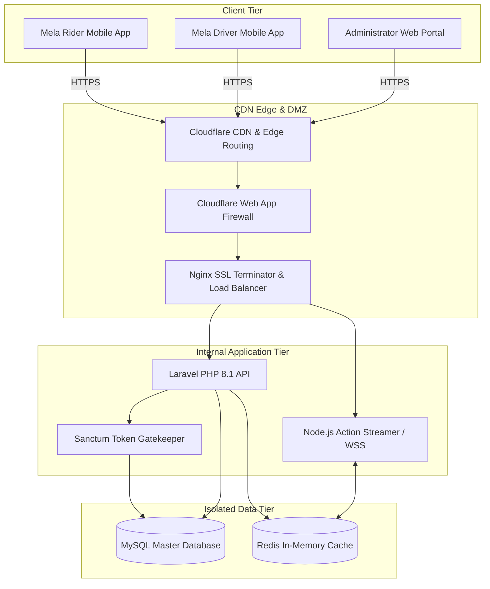
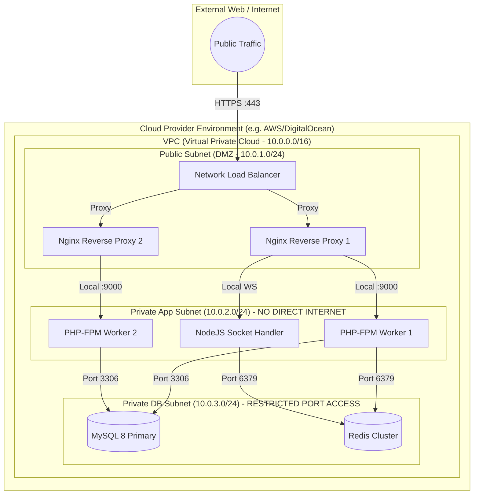
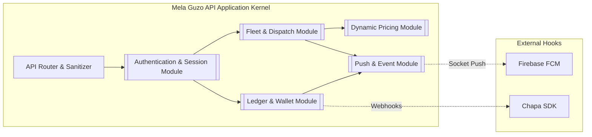
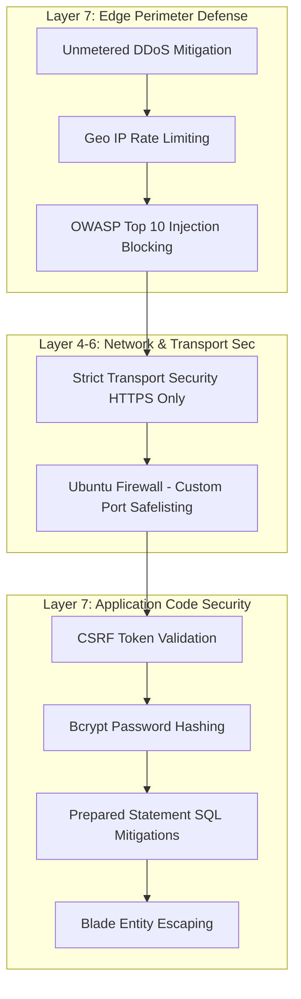
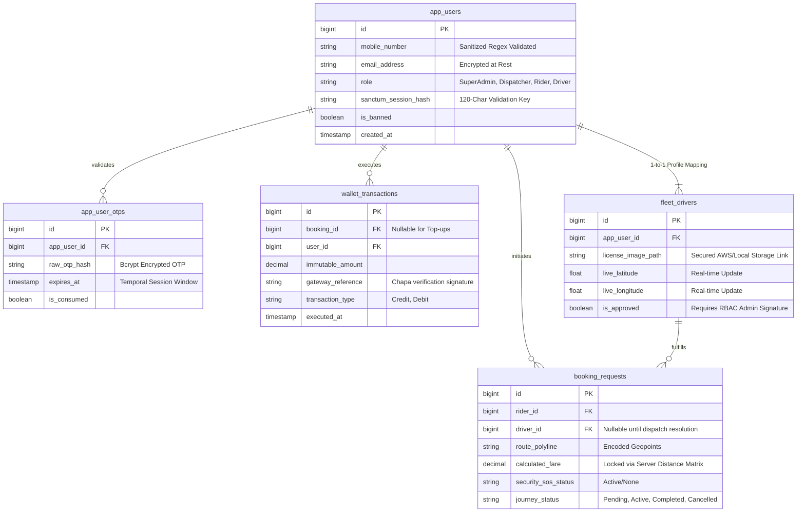

# Mela Guzo Web Application Diagrams

These comprehensive reference diagrams are constructed explicitly to satisfy the **5.1 Business Architecture and Design** requirements prescribed by the INSA Web Application Security Testing Assessment.

---

### 1. Data Flow Diagrams (DFD) 

#### 1.1 Level 0: Context Data Flow Diagram
This indicates the high-level boundary interaction of the Mela Guzo platform with external actants.

#### 1.2 Level 1: Detailed Data Flow Diagram
This elaborates on the internal data transformations occurring within the `Mela Guzo Core Backend System`.

#### 1.3 Level 2: Authentication & Token Lifecycle Processing
A deep-dive sequence DFD illustrating how the system verifies user identity via OTP and generates the dual-layered authentication tokens (Sanctum + Session Keys).

#### 1.4 Level 2: Secure Ride Booking & Wallet Settlement Flow
A sequence flow mapping the complex interactions when dispatching a vehicle and locking financial states securely into the ledger.

---

### 2. System Architecture Diagrams

#### 2.1 Ecosystem Architecture Diagram (Global View)
This blueprint maps the overall platform, emphasizing the security perimeter, application tiers, and third-party interactions.

#### 2.2 Deployment Architecture Topology (Network Zoning)
This visualizes the physical network hosting paradigm, showcasing how servers are isolated via Virtual Private Clouds (VPC) and Subnets.

#### 2.3 Application Component Architecture (Module Isolation)
Highlights the micro-modular approach inside the monolithic API structure, describing how distinct logic blocks interface internally.

#### 2.4 Security Layers & Threat Mitigation Zones
A structural representation mapping specific security standards and protocols applied across different system OSI layers.

---

### 3. Entity Relationship Diagram (ERD) - Core Security Models

#### 3.1 ERD: Identifying PII & Transaction Keys
This diagram specifically highlights fields scrutinized for security, PII isolation, and financial integrity. 

