# Software Requirements Specification (SRS) Diagrams for Mela Guzo
**Prepared By:** Marvels Creative Technology  
**Version:** 1.0  

This document contains 16 comprehensive system diagrams constructed to support the Software Requirements Specification (SRS) for the Mela Guzo platform.

---

### 1. Overall System Use Case Diagram
This visualizes the high-level boundary and the primary actors interacting with the entire Mela Guzo ecosystem.

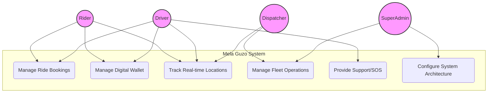

---

### 2. Rider Specific Use Case Diagram
Details the exact systemic permissions and triggers available specifically to the passenger client app.

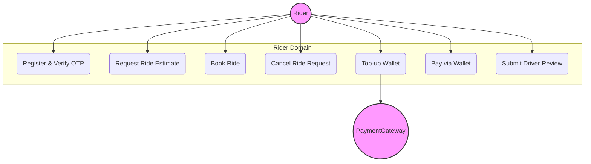

---

### 3. Driver Specific Use Case Diagram
Focuses on the mobile application capabilities exclusively tailored for fleet drivers.

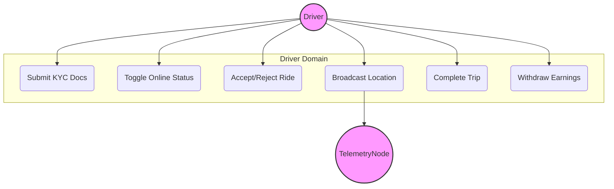

---

### 4. Admin & Dispatcher Use Case Diagram
Visualizes the backend operations portal mapping for corporate staff.

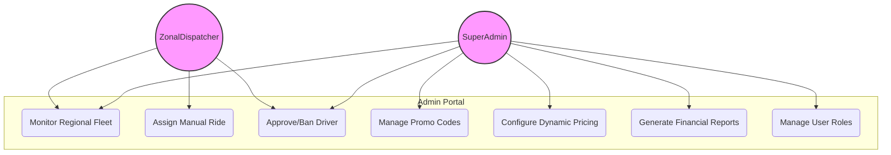

---

### 5. Sequence Diagram: Authentication & OTP Verification
Illustrates the chronological API calls required to securely onboard a new rider using SMS OTP.

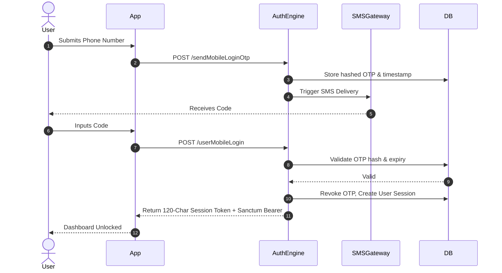

---

### 6. Sequence Diagram: Ride Booking & Matching Algorithm
Steps executed when matching a rider to the nearest compatible driver.

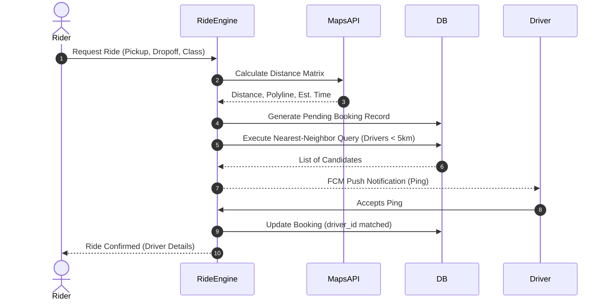

---

### 7. Sequence Diagram: Wallet Top-Up (Chapa Gateway)
Maps the secure asynchronous webhook processing for topping up a rider wallet.

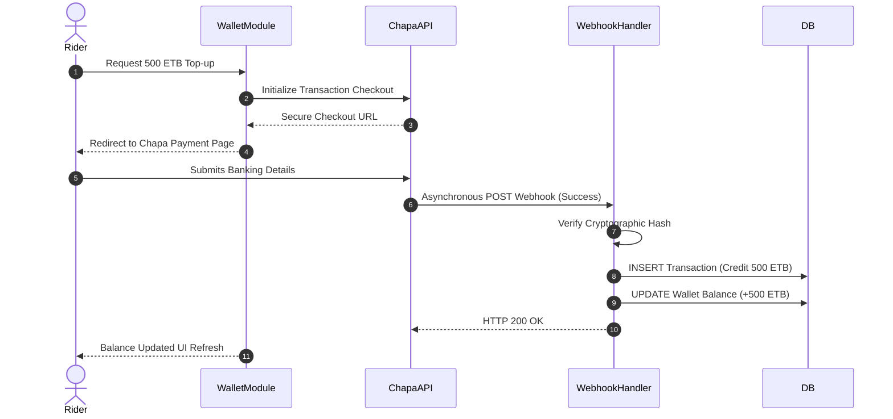

---

### 8. Sequence Diagram: Ride Completion & automated Payment Settlement
Shows how the system executes a ride-end trigger and balances the internal ledgers.

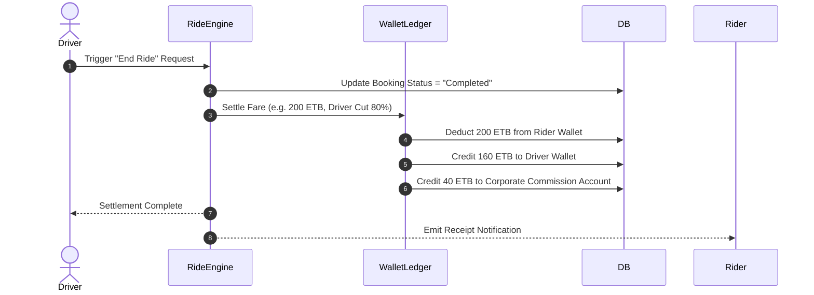

---

### 9. Activity Diagram: Driver Onboarding Workflow
Details the conditional branching involved in verifying a driver's legal application to join the fleet.

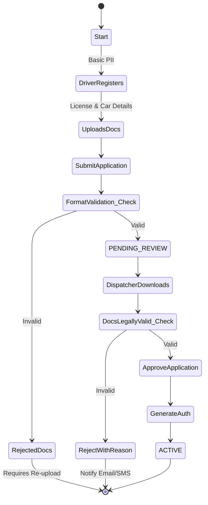

---

### 10. Activity Diagram: The Complete Ride Lifecycle
Outlines the logic from booking creation to completion or cancellation.

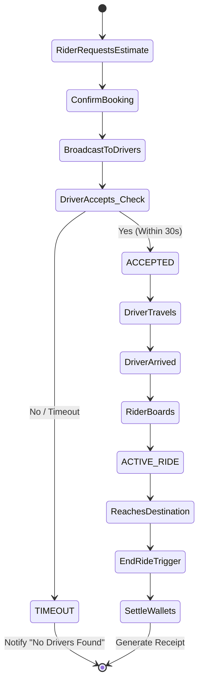

---

### 11. State Machine Diagram: Ride Status
Tracks the exact lifecycle of the `booking_requests` database entity.

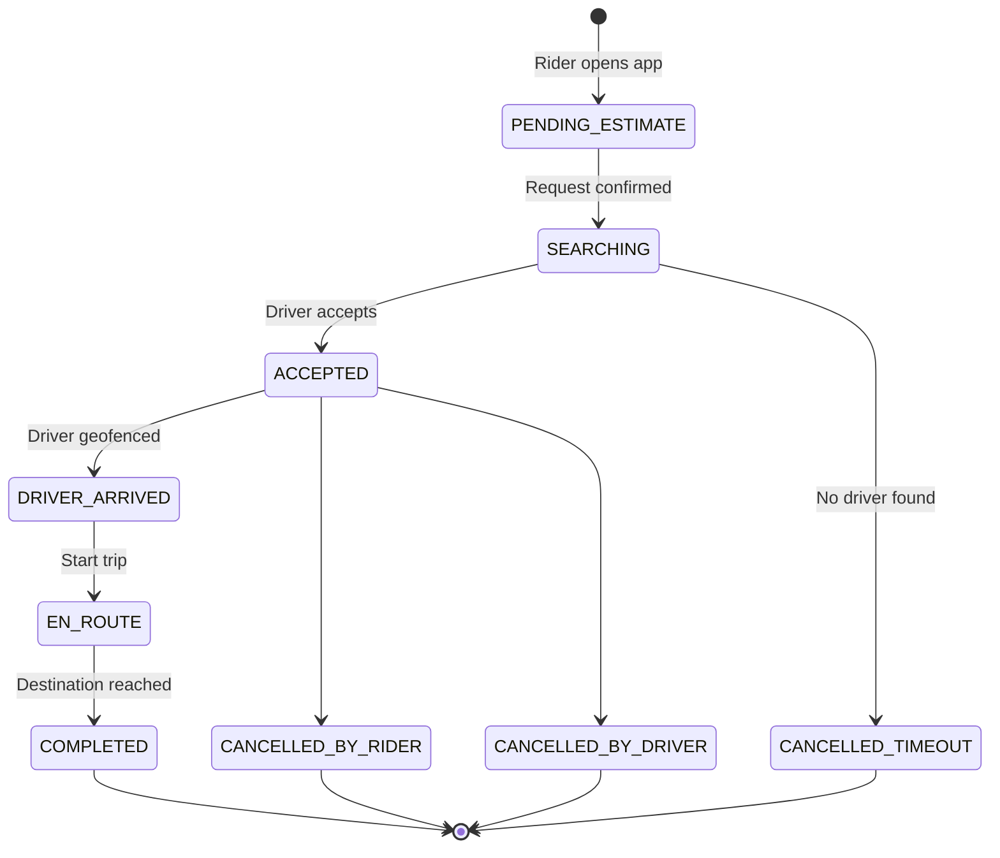

---

### 12. State Machine Diagram: Driver Operational Status
Shows how a driver toggles availability to the algorithmic dispatcher.

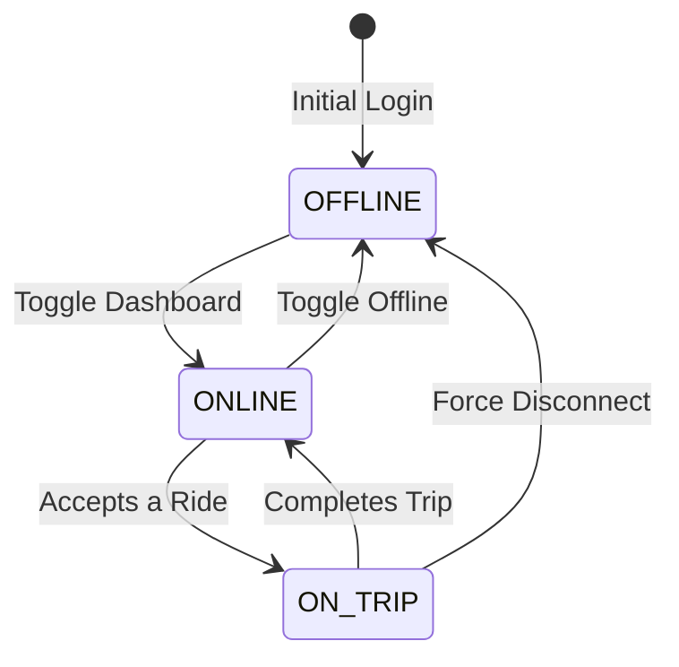

---

### 13. System Entity Relationship Diagram (Class Level)
Displays how relational tables map in the MySQL Database structure underlying the software requirements.

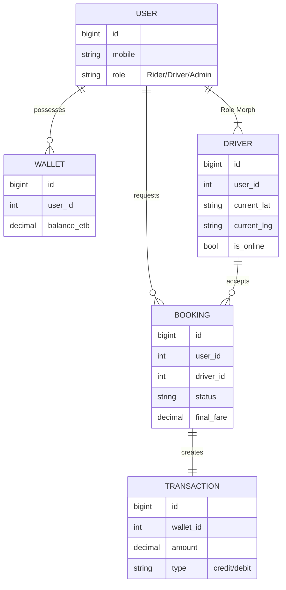

---

### 14. Component Diagram: System Modules (Micro-Level)
Illustrates the internal software component relationships within the monolithic core.

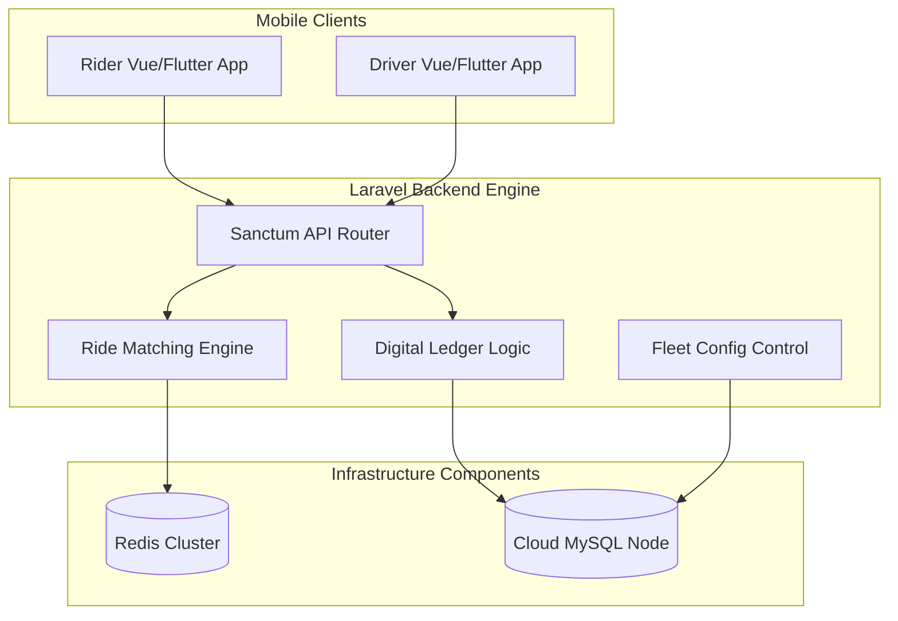

---

### 15. Deployment Architecture Diagram
Demonstrates how the Mela Guzo platform fulfills the performance requirement of high availability through cloud architecture.

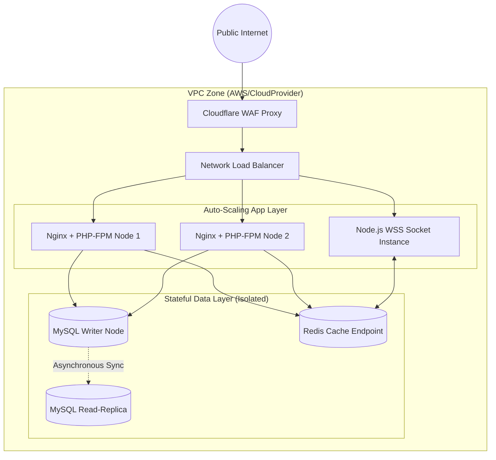

---

### 16. Communication Diagram (WebSocket Real-Time Tracking)
Maps the event-driven broadcast system responsible for updating driver cars moving across the map UI.

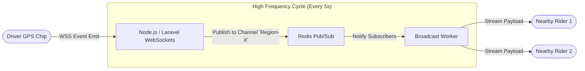

## 7. Threat Modeling (STRIDE)

### 7.1 STRIDE Threat Assessment Model
To ensure rigorous security compliance, the platform's core architecture has been analyzed against the STRIDE threat classification model (Spoofing, Tampering, Repudiation, Information Disclosure, Denial of Service, Elevation of Privilege).

The following diagram maps these theoretical vulnerability vectors against the primary system components and illustrates the enforced systemic mitigations.

```mermaid
graph TD
    classDef spoofing fill:#ff9999,stroke:#333,stroke-width:2px;
    classDef tampering fill:#ffcc99,stroke:#333,stroke-width:2px;
    classDef repudiation fill:#ffff99,stroke:#333,stroke-width:2px;
    classDef infodisc fill:#ccff99,stroke:#333,stroke-width:2px;
    classDef dos fill:#99ccff,stroke:#333,stroke-width:2px;
    classDef eop fill:#cc99ff,stroke:#333,stroke-width:2px;

    %% Components
    MobileApp(Mobile Client)
    API[API Gateway / WAF]
    AuthLayer[Auth Layer Sanctum]
    DB[(Core MySQL DB)]
    Ledger[Wallet Ledger]

    %% Threat Classifications Mapping
    Spoofing(Spoofing Identity):::spoofing
    Tampering(Tampering with Data):::tampering
    Repudiation(Repudiation):::repudiation
    InfoDisc(Information Disclosure):::infodisc
    DoS(Denial of Service):::dos
    EoP(Elevation of Privilege):::eop

    %% Link threats to vulnerable modules
    Spoofing -.->|Mitigated by OTP & MFA| MobileApp
    Spoofing -.->|Mitigated by Bearer Tokens| AuthLayer
    
    Tampering -.->|Mitigated by TLS 1.3 & WAF| API
    Tampering -.->|Mitigated by Prepared Statements| DB
    
    Repudiation -.->|Mitigated by Audit Logging| Ledger
    Repudiation -.->|Mitigated by App Logs| API
    
    InfoDisc -.->|Mitigated by Data Encryption| DB
    InfoDisc -.->|Mitigated by App Obfuscation| MobileApp
    
    DoS -.->|Mitigated by Cloudflare Shield| API
    DoS -.->|Mitigated by Rate Limiting| AuthLayer
    
    EoP -.->|Mitigated by Role Based Access| AuthLayer
    EoP -.->|Mitigated by Least Privilege Accounts| DB
```
