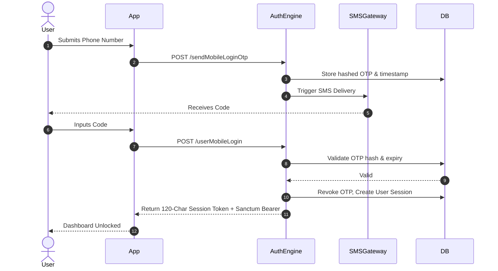
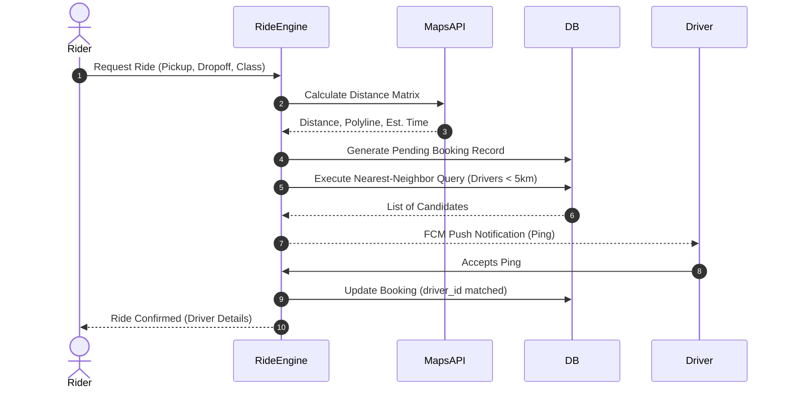
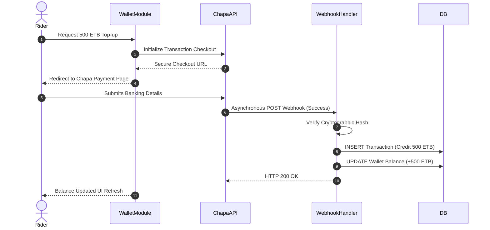
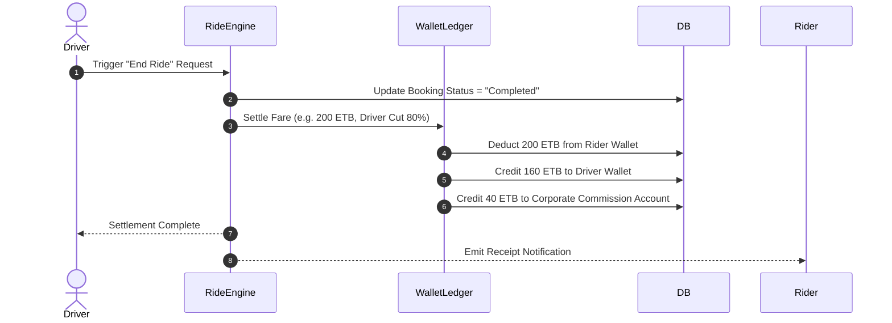
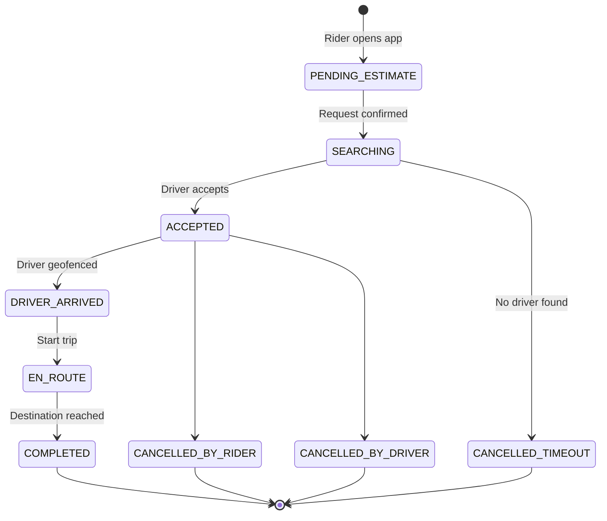
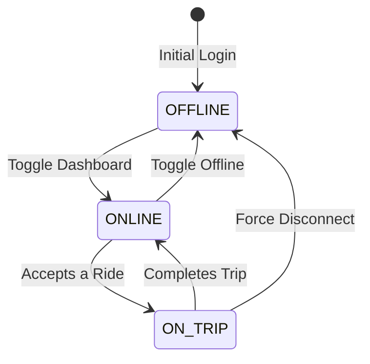
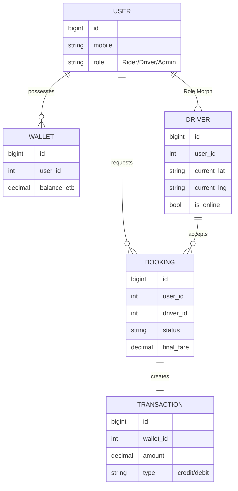
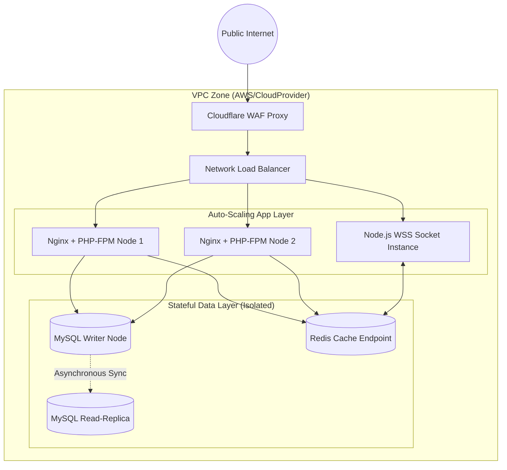

# Software Requirements Specification (SRS) Diagrams for Mela Guzo
**Prepared By:** Marvels Creative Technology  
**Version:** 1.0  

This document contains 16 comprehensive system diagrams constructed to support the Software Requirements Specification (SRS) for the Mela Guzo platform.

---

### 1. Overall System Use Case Diagram
This visualizes the high-level boundary and the primary actors interacting with the entire Mela Guzo ecosystem.

```mermaid
usecaseDiagram
    actor Rider
    actor Driver
    actor Dispatcher
    actor SuperAdmin
    
    package "Mela Guzo System" {
        usecase "Manage Ride Bookings" as UC1
        usecase "Manage Digital Wallet" as UC2
        usecase "Track Real-time Locations" as UC3
        usecase "Manage Fleet Operations" as UC4
        usecase "Provide Support/SOS" as UC5
        usecase "Configure System Architecture" as UC6
    }
    
    Rider --> UC1
    Rider --> UC2
    Rider --> UC3
    Driver --> UC1
    Driver --> UC2
    Driver --> UC3
    Driver --> UC5
    Dispatcher --> UC4
    Dispatcher --> UC3
    SuperAdmin --> UC6
    SuperAdmin --> UC4
```

---

### 2. Rider Specific Use Case Diagram
Details the exact systemic permissions and triggers available specifically to the passenger client app.

```mermaid
usecaseDiagram
    actor Rider
    actor PaymentGateway
    
    package "Rider Domain" {
        usecase "Register & Verify OTP" as R1
        usecase "Request Ride Estimate" as R2
        usecase "Book Ride" as R3
        usecase "Cancel Ride Request" as R4
        usecase "Top-up Wallet" as R5
        usecase "Pay via Wallet" as R6
        usecase "Submit Driver Review" as R7
    }
    
    Rider --> R1
    Rider --> R2
    Rider --> R3
    Rider --> R4
    Rider --> R5
    Rider --> R6
    Rider --> R7
    R5 --> PaymentGateway
```

---

### 3. Driver Specific Use Case Diagram
Focuses on the mobile application capabilities exclusively tailored for fleet drivers.

```mermaid
usecaseDiagram
    actor Driver
    actor TelemetryNode
    
    package "Driver Domain" {
        usecase "Submit KYC Docs" as D1
        usecase "Toggle Online Status" as D2
        usecase "Accept/Reject Ride" as D3
        usecase "Broadcast Location" as D4
        usecase "Complete Trip" as D5
        usecase "Withdraw Earnings" as D6
    }
    
    Driver --> D1
    Driver --> D2
    Driver --> D3
    Driver --> D4
    Driver --> D5
    Driver --> D6
    D4 --> TelemetryNode
```

---

### 4. Admin & Dispatcher Use Case Diagram
Visualizes the backend operations portal mapping for corporate staff.

```mermaid
usecaseDiagram
    actor ZonalDispatcher
    actor SuperAdmin
    
    package "Admin Portal" {
        usecase "Monitor Regional Fleet" as A1
        usecase "Assign Manual Ride" as A2
        usecase "Approve/Ban Driver" as A3
        usecase "Manage Promo Codes" as A4
        usecase "Configure Dynamic Pricing" as A5
        usecase "Generate Financial Reports" as A6
        usecase "Manage User Roles" as A7
    }
    
    ZonalDispatcher --> A1
    ZonalDispatcher --> A2
    ZonalDispatcher --> A3
    
    SuperAdmin --> A1
    SuperAdmin --> A3
    SuperAdmin --> A4
    SuperAdmin --> A5
    SuperAdmin --> A6
    SuperAdmin --> A7
```

---

### 5. Sequence Diagram: Authentication & OTP Verification
Illustrates the chronological API calls required to securely onboard a new rider using SMS OTP.



---

### 6. Sequence Diagram: Ride Booking & Matching Algorithm
Steps executed when matching a rider to the nearest compatible driver.



---

### 7. Sequence Diagram: Wallet Top-Up (Chapa Gateway)
Maps the secure asynchronous webhook processing for topping up a rider wallet.



---

### 8. Sequence Diagram: Ride Completion & automated Payment Settlement
Shows how the system executes a ride-end trigger and balances the internal ledgers.



---

### 9. Activity Diagram: Driver Onboarding Workflow
Details the conditional branching involved in verifying a driver's legal application to join the fleet.

```mermaid
activityDiagram
    start
    :Driver Registers Basic PII;
    :Driver Uploads 
    License & Car Details;
    :Submit Application;
    
    if (Automated Format Validation OK?) then (Yes)
        :Set Status = PENDING_REVIEW;
    else (No)
        :Reject Docs (Requires Re-upload);
        end
    endif
    
    :Dispatcher Downloads Docs;
    if (Docs Legally Valid?) then (Yes)
        :Approve Application;
        :Generate Authentication Credentials;
        :Set Status = ACTIVE;
    else (No)
        :Reject with Reason;
        :Notify via Email/SMS;
    endif
    stop
```

---

### 10. Activity Diagram: The Complete Ride Lifecycle
Outlines the logic from booking creation to completion or cancellation.

```mermaid
activityDiagram
    start
    :Rider Requests Fare Estimate;
    :Rider Confirms Booking;
    :System Broadcasts to Local Drivers;
    
    if (Driver Accepts Within 30s?) then (Yes)
        :Booking State = ACCEPTED;
        :Driver Travels to Pickup;
        :Driver Triggers ARRIVED;
        :Rider Boards Vehicle;
        :Toggle State = ACTIVE_RIDE;
        :Driver Reaches Destination;
        :Trigger End Ride;
        :Settle Wallets & Generate Receipt;
    else (No/Timeout)
        :Booking State = TIMEOUT;
        :Notify Rider "No Drivers Found";
    endif
    stop
```

---

### 11. State Machine Diagram: Ride Status
Tracks the exact lifecycle of the `booking_requests` database entity.



---

### 12. State Machine Diagram: Driver Operational Status
Shows how a driver toggles availability to the algorithmic dispatcher.



---

### 13. System Entity Relationship Diagram (Class Level)
Displays how relational tables map in the MySQL Database structure underlying the software requirements.



---

### 14. Component Diagram: System Modules (Micro-Level)
Illustrates the internal software component relationships within the monolithic core.

```mermaid
componentDiagram
    package "Mobile Clients" {
        [Rider Vue/Flutter App]
        [Driver Vue/Flutter App]
    }
    
    package "Laravel Backend Engine" {
        [Sanctum API Router]
        [Ride Matching Engine]
        [Digital Ledger Logic]
        [Fleet Config Control]
    }
    
    package "Infrastructure Components" {
        [Redis Cluster]
        [Cloud MySQL Node]
    }
    
    [Rider Vue/Flutter App] --> [Sanctum API Router]
    [Driver Vue/Flutter App] --> [Sanctum API Router]
    
    [Sanctum API Router] --> [Ride Matching Engine]
    [Sanctum API Router] --> [Digital Ledger Logic]
    
    [Ride Matching Engine] --> [Redis Cluster]
    [Digital Ledger Logic] --> [Cloud MySQL Node]
    [Fleet Config Control] --> [Cloud MySQL Node]
```

---

### 15. Deployment Architecture Diagram
Demonstrates how the Mela Guzo platform fulfills the performance requirement of high availability through cloud architecture.



---

### 16. Communication Diagram (WebSocket Real-Time Tracking)
Maps the event-driven broadcast system responsible for updating driver cars moving across the map UI.


