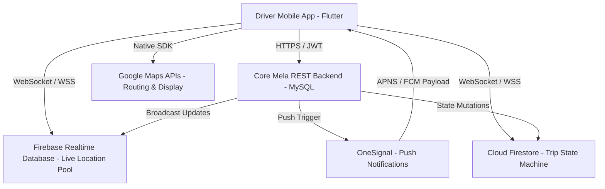
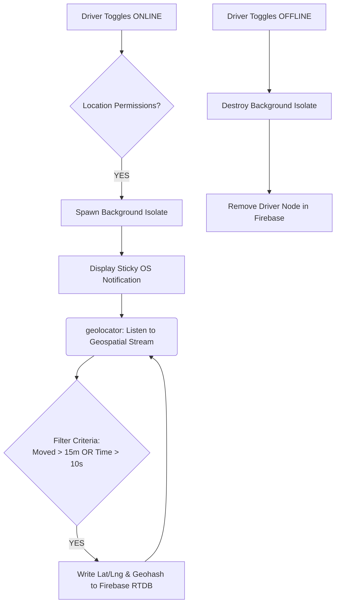
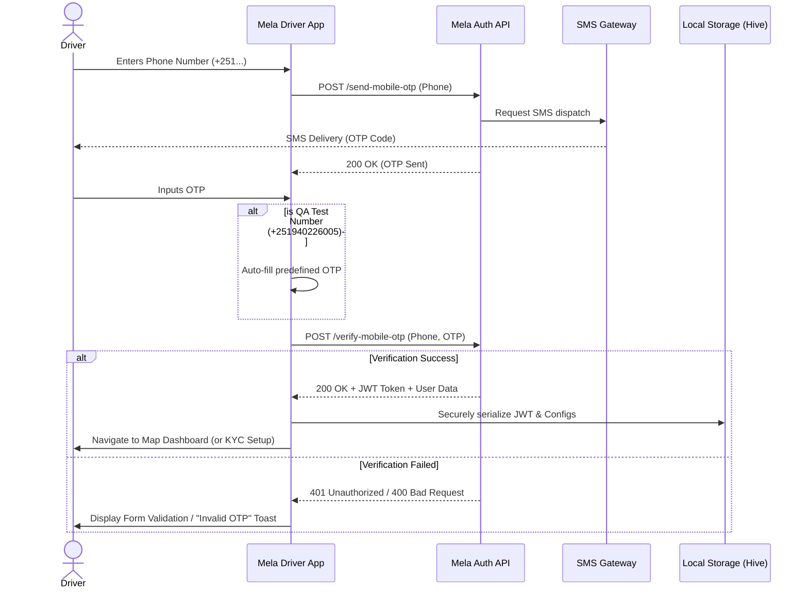
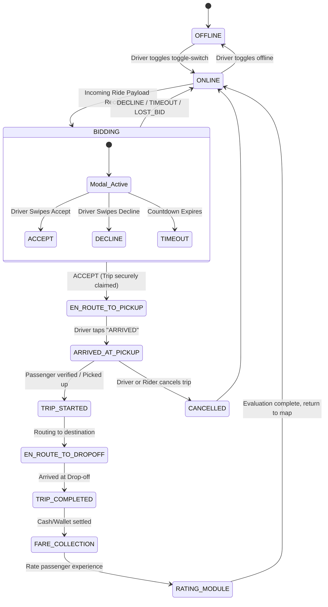
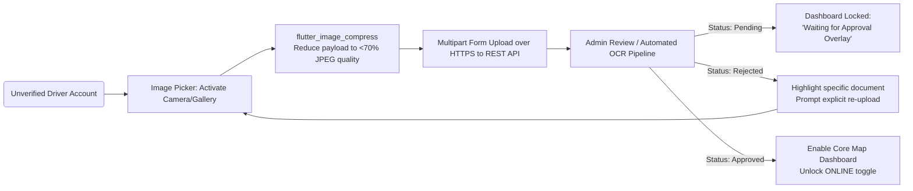

# Cover Page

**Company Name:** Marvels Creative Technology  
**Application Name:** Mela Driver Application (ride_on_driver)  
**Document Type:** Mobile Application Security Testing Requirements Document  
**Target Authority:** Information Network Security Administration (INSA)  

---

     

## Table of Contents
1. [Background of Organization](#1-background-of-organization)
2. [Introduction](#2-introduction)
3. [Objective of Certificate Requested](#3-objective-of-certificate-requested)
4. [Business Architecture & Design Requirements](#4-business-architecture--design-requirements)
5. [Purpose & Functional Information](#5-purpose--functional-information)
6. [Defined Audit Scope](#6-defined-audit-scope)
7. [Contact Information](#7-contact-information)
8. [Conclusion](#8-conclusion)

---

## 1. Background of Organization
Marvels Creative Technology is a modern technology company dedicated to creating scalable, robust, and localized software solutions tailored to the Ethiopian market. Our ecosystem involves optimizing specific industries—including transportation—by bridging the gap between service providers and end-users with highly efficient digital platforms such as Mela. 

## 2. Introduction
This document serves as the formal specification and prerequisite information submission for the mobile application security audit conducted by INSA. It comprehensively details the architecture, functionality, security layers, and testing scope for the **Mela Driver Application**, the provider-facing component of our dual-sided ride-hailing and delivery platform.

## 3. Objective of Certificate Requested
The core objective of this request is to obtain a formal Security Clearance and Certification from INSA. This certification will validate that the Mela Driver Application adheres to national security guidelines, securely processes personally identifiable information (PII), and is resilient against standard cyber threats, ensuring the safety of Ethiopian citizens using the platform.

---

## 4. Business Architecture & Design Requirements

### 4.1 Business Architecture & Design Overview
The Mela Driver Application operates as an independent client node within a distributed ride-hailing architecture. It interfaces dynamically with a central REST API backend (MySQL), a real-time middleware layer powered by Firebase (Realtime Database & Cloud Firestore), and third-party orchestration providers like Google Maps and OneSignal. The app focuses on real-time location telemetry and state management to connect available drivers to riders.

### 4.2 Application Type
- **Type:** Native Mobile Application 
- **Framework:** Flutter SDK (`>=3.4.3 < 4.0.0`) targeting native Android and iOS deployments.

### 4.3 System Architecture Diagram
The architecture relies on high-speed event streams for dispatch operations.

### 4.4 Data Flow Diagram (DFD)
The core location tracking and backend synchronization flow is highlighted below:

### 4.5 Driver Authentication & Onboarding Sequence
To ensure accountability and security, the application mandates a stringent OTP-based login flow.

### 4.6 Trip Lifecycle State Machine
Trips are strictly managed through a state machine, guaranteeing synchronization between the driver, rider, and backend.

### 4.7 KYC Document Verification Flow
Drivers must be verified before going online. The verification handles sensitive images and compresses them before transmission.

### 4.8 Threat Model Mapping
- **Spoofing & Unauthorized Access:** Mitigated through SMS-based OTP multifactor authentication. User sessions are sealed with JWT. 
- **Data Tampering & Interception:** All API transit must be over HTTPS (TLS 1.2+); WebSockets over WSS. Local storage payload is encrypted using Hive AES-256 bits.
- **Unauthorized Data Access:** Firebase Realtime Database rules actively restrict payload visibility, ensuring users strictly modify their own allocated geospatial documents.
- **Denial of Service (DoS):** Redundant REST API limits, Firebase usage firewalls, and aggressive client-side timeout logic (15,000ms max execution) protect against infrastructure saturation.

### 4.9 System Functionality Description
- **Authentication:** Region-locked (+251) mobile OTP login mechanism.
- **KYC Document Pipeline:** Image capture, client-side compression (<70% quality, max width 1920px), and HTTP multipart transmission for IDs and vehicular documentation.
- **Live Bidding & Dispatch:** Utilizing WSS Firebase connections and auditory alarms to present ride options to drivers with low latency.
- **Routing:** Google Maps polyline integrations routing from driver coordinates to pickup to drop-off nodes.
- **Wallet Ledgers:** Tracking all trip earnings and calculations algorithmically via the backend and mirroring to the UI.

### 4.10 Role / System Actor Relationship
1. **Driver (End-User):** Inputs coordinates via GPS, accepts operations, transmits documents.
2. **Rider (External Actor):** Requests trips via the connected Rider app. 
3. **Admin / System Integrator:** Monitors operations, runs KYC validations on submitted documents.
4. **Mela Backend System:** Processes financial tracking, OTP dispatching, issue JWTs, handles trip states. 

### 4.11 Test Account (For Auditors)
- **QA Phone Number:** `+251940226005`
*(Note: Passing this number bypasses the external SMS trigger during Authentication and autofills predefined OTP codes for seamless testing).*

---

## 5. Purpose & Functional Information

### 5.1 Purpose of the Mobile Application
To provide drivers operating within the Mela network an interface to onboard securely, process regulatory KYC checks, toggle their availability, receive real-time ride bids, navigate to endpoints, and track their financial earnings.

### 5.2 Supported Operating Systems
- **Android:** Minimum SDK 24 (Android 7.0 Nougat), Target SDK 34.
- **Apple iOS:** Minimum deployment target iOS 13.0.

### 5.3 Source Code OR Binary
- Both access mechanisms (Source Code Repository linking and Compiled APKs `app-release.apk`) will be provisionally shared via our secure distribution channel per INSA’s request.

### 5.4 Functionalities Requiring Detailed Testing
- Background `geolocator` telemetry loop and Firebase WSS synchronization.
- Authentication Token (JWT) management via Hive AES local storage.
- KYC Document image compression and Multipart upload.

### 5.5 Compliance or Security Requirements
- Compliance with local transportation laws (KYC mandatory).
- Compliance with App Store Review Guidelines (Specifically 5.1.1 "Data Collection" and 2.5.4 "Background Location").
- Strict reliance on non-obfuscated permissions flows indicating the necessity of Always-On Location gathering.

### 5.6 Authentication Mechanisms Used
- 9-Digit Phone Validation -> OTP challenge dispatched via third-party SMS aggregator.
- Session Management uses strictly timed stateless JSON Web Tokens (JWT) stored client-side in secured keystores. 

### 5.7 Sensitive Data Information
- **Is sensitive data stored or transmitted?** Yes. PII (Names, Phone Numbers, KYC Documents, Live Geocoordinates) are transmitted. 
- **Handling:** Transmitted exclusively using TLS 1.2 Encrypted tunnels. Locally, keys and tokens are AES-256 encrypted using the `hive` datastore. Documents are discarded from local RAM immediately post-upload. 

### 5.8 Third-Party Integrations / APIs
- **Google Maps Platform:** Maps Native SDK, Directions API, Places/Autocomplete API, Geocoding API.
- **Firebase Ecosystem:** Realtime Database, Cloud Firestore, Cloud Messaging.
- **OneSignal:** Cross-platform Push Notification orchestrator.

### 5.9 Testing Restrictions or Limitations
- Direct SMS OTP requests are rate-limited by upstream providers. Testing *must* utilize the dedicated test number `+251940226005` to bypass telecom restrictions. 

### 5.10 Known Vulnerabilities or Security Concerns
- None natively known, though background tracking services remain heavily scrutinized by OEM battery management controllers which may periodically sever tracking if Android devices optimize the isolate. 

---

## 6. Defined Audit Scope

| Criteria | Specification |
|----------|---------------|
| **Name of Assets to be Audited** | Mela Driver Application (ride_on_driver) Mobile App |
| **APK / Official Link** | *To be securely provided via Marvels Creative Technology administrative channels* |
| **Test Account Credentials** | Phone Number: **+251940226005** (Programmatic OTP Bypass) |
| **Testing Regimens Requested** | - Static Application Security Testing (SAST) - Dynamic Application Security Testing (DAST) - Automated Source Code Analysis - Penetration against the local database schema |

---

## 7. Contact Information

**Company Name:** Marvels Creative Technology  
**Address:** Addis Ababa, Ethiopia  

*(Please replace the below with exact administrative contacts as needed)*  
- **Name:** Management / Technical Lead  
- **Role:** Point of Contact for Audit Review  
- **Email:** security@marvels-creative.com  
- **Mobile Number:** +251 900 000000  

---

## 8. Conclusion
This document serves as the absolute baseline understanding of the Mela Driver Application for the purposes of security validation. We welcome INSA's thorough analysis of our infrastructure, data pathways, and cryptographic implementations. We are highly committed to providing whatever further logs, access, or binaries are required to successfully certify the safety and privacy standards of our platform.
