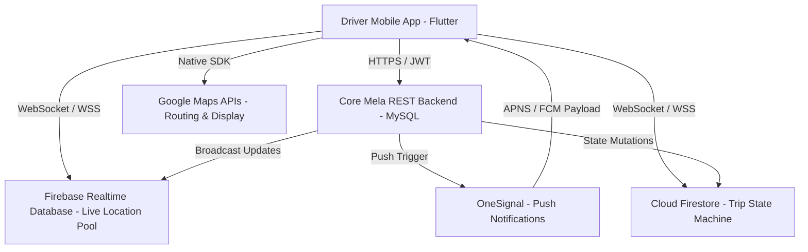
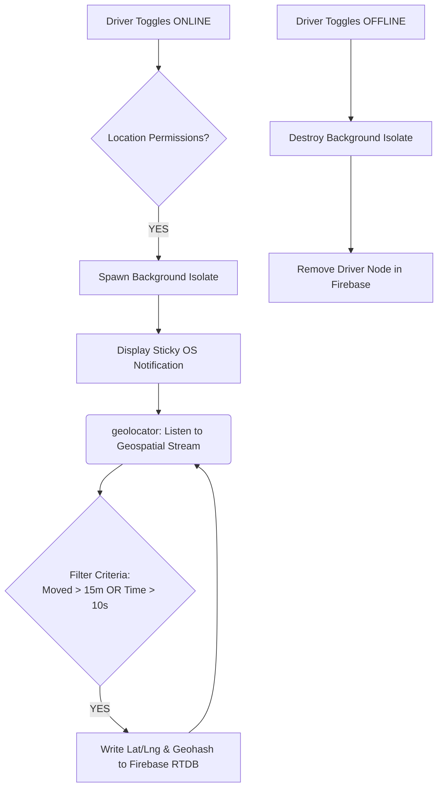
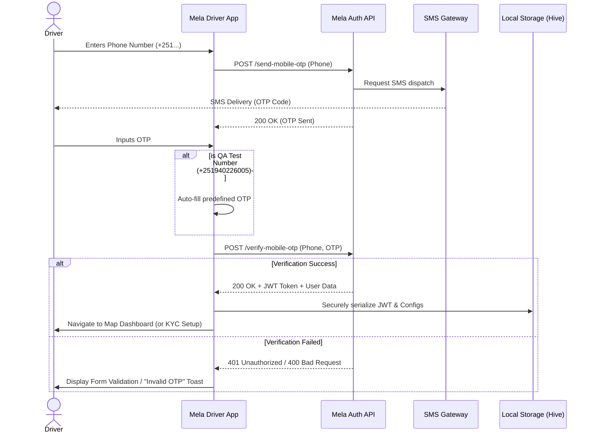
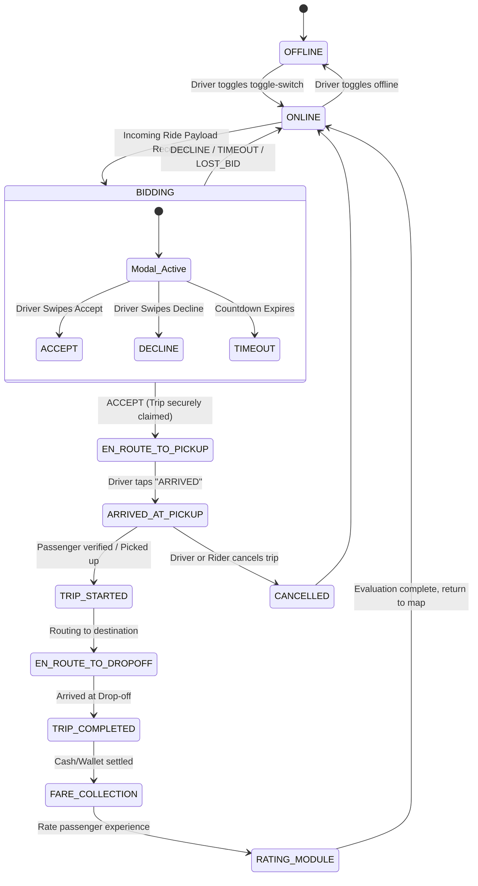
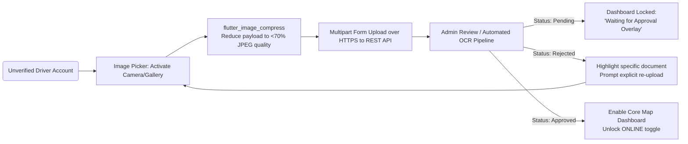

### 4.3 System Architecture Diagram
The architecture relies on high-speed event streams for dispatch operations.

### 4.4 Data Flow Diagram (DFD)
The core location tracking and backend synchronization flow is highlighted below:

### 4.5 Driver Authentication & Onboarding Sequence
To ensure accountability and security, the application mandates a stringent OTP-based login flow.

### 4.6 Trip Lifecycle State Machine
Trips are strictly managed through a state machine, guaranteeing synchronization between the driver, rider, and backend.

### 4.7 KYC Document Verification Flow
Drivers must be verified before going online. The verification handles sensitive images and compresses them before transmission.

rstanding of the Mela Driver Application for the purposes of security validation. We welcome INSA's thorough analysis of our infrastructure, data pathways, and cryptographic implementations. We are highly committed to providing whatever further logs, access, or binaries are required to successfully certify the safety and privacy standards of our platform.
