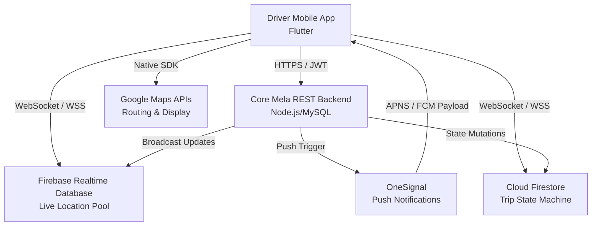
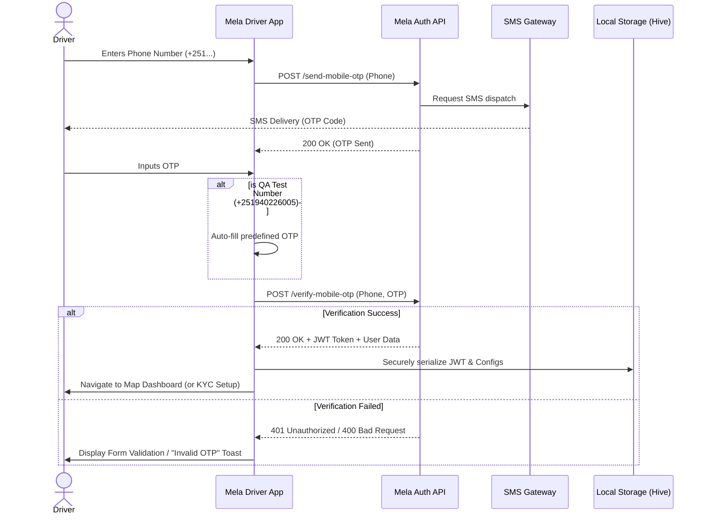
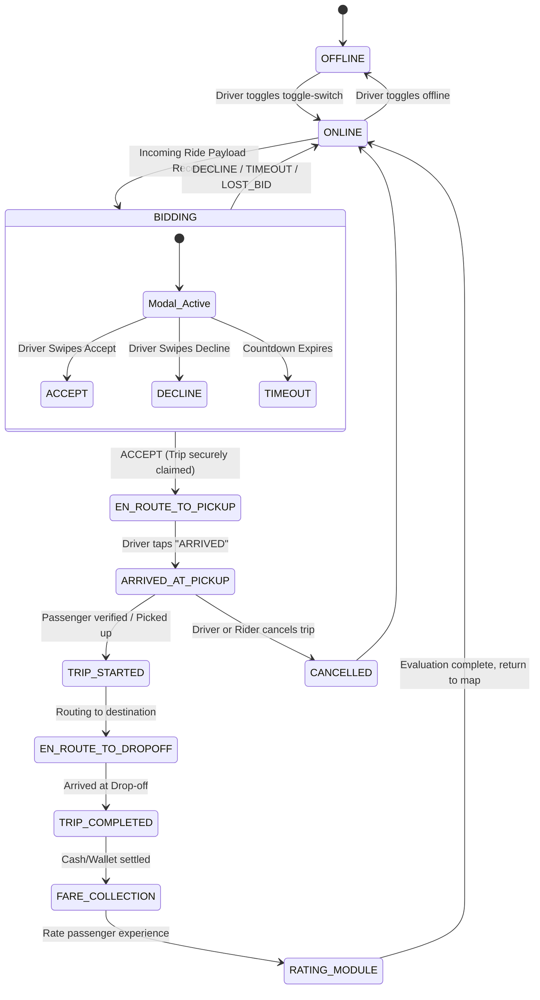
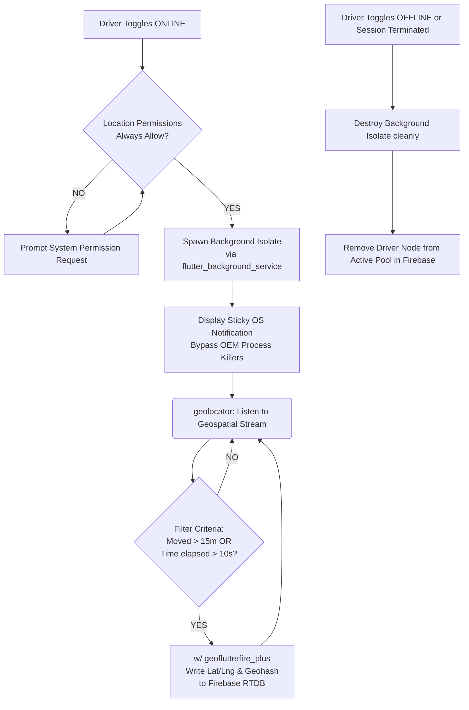
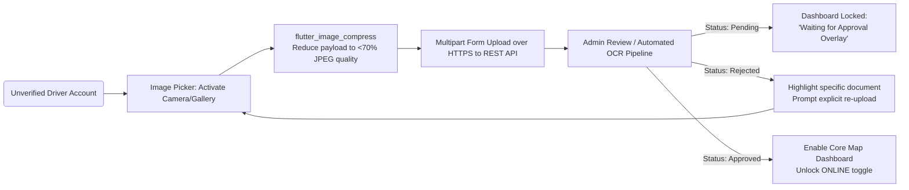

ww# Mela Driver Application - SRS Diagrams

This document contains Mermaid diagrams that visually represent various aspects of the Software Requirements Specification (SRS) for the Mela Driver Application. Each diagram specifies the section of the SRS document where it should be referenced or inserted to provide visual context to the technical written requirements.

---

## 1. High-Level System Architecture
**Target SRS Section:** `6. System Architecture and Data Flow` -> `6.1 Technology Stack` & `6.2 Firebase Integration Architecture`

---

## 2. Driver Authentication & Onboarding Sequence
**Target SRS Section:** `3. System Features` -> `3.1 Driver Onboarding & Authentication`

---

## 3. Trip Lifecycle State Machine
**Target SRS Section:** `3. System Features` -> `3.6 Trip State Management`

---

## 4. Background Telemetry (Location Tracking) Flow
**Target SRS Section:** `3. System Features` -> `3.9 Background Location Tracking Services`

---

## 5. KYC Document Verification Flow
**Target SRS Section:** `3. System Features` -> `3.2 Document Verification System`

