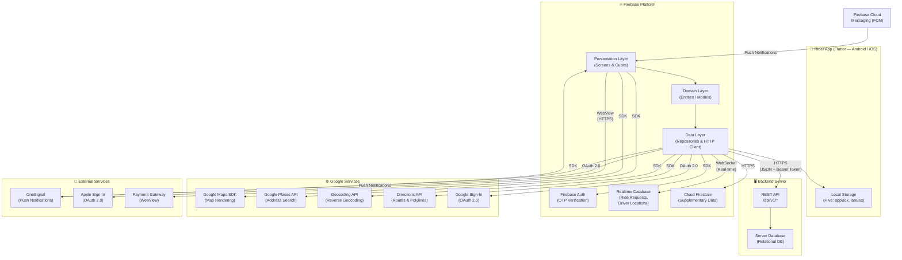
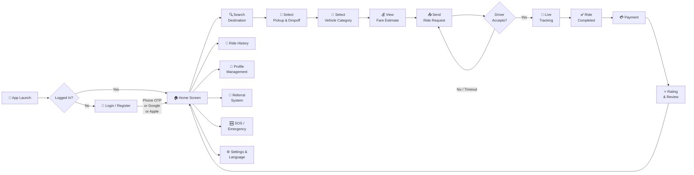
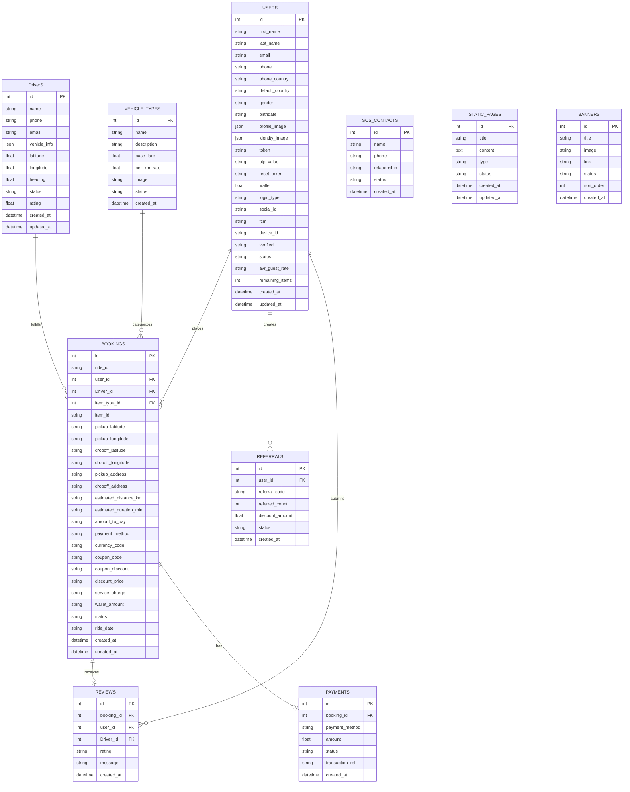
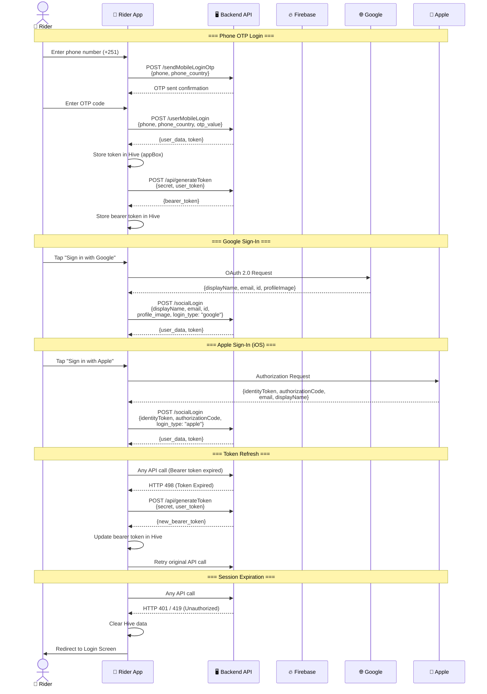
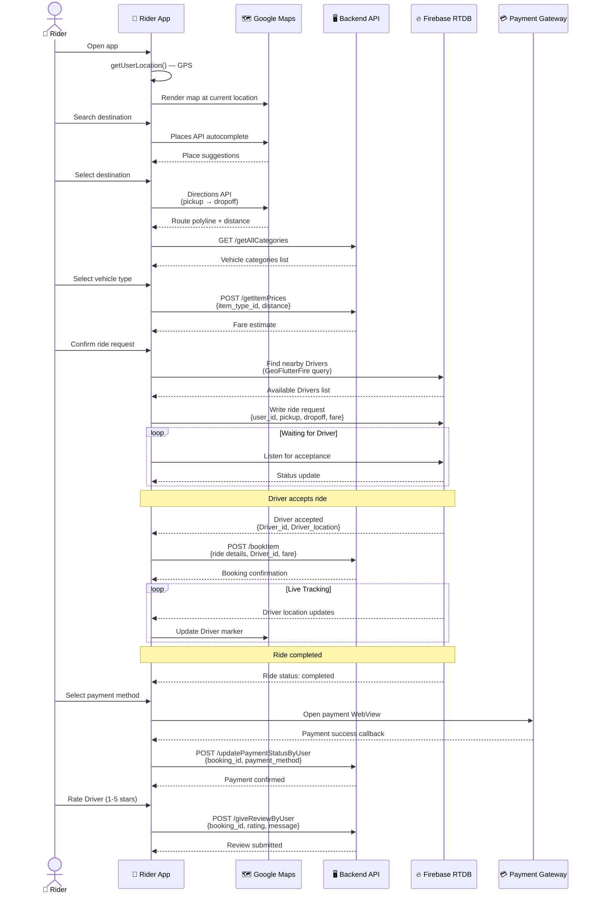
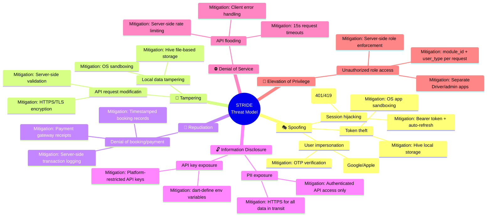
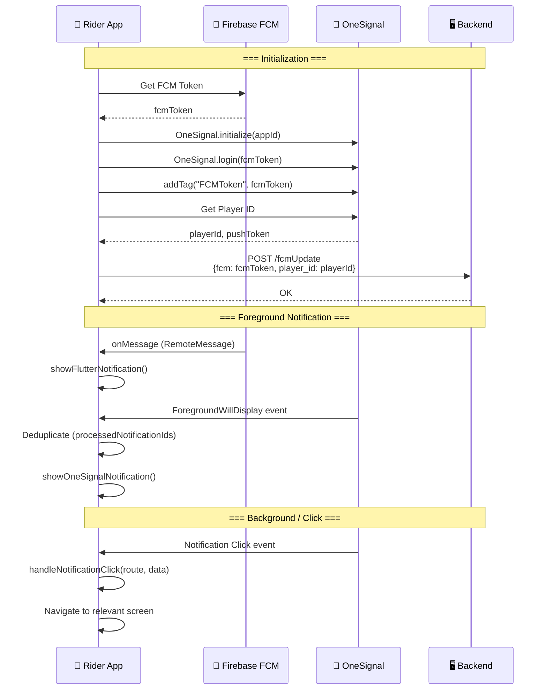
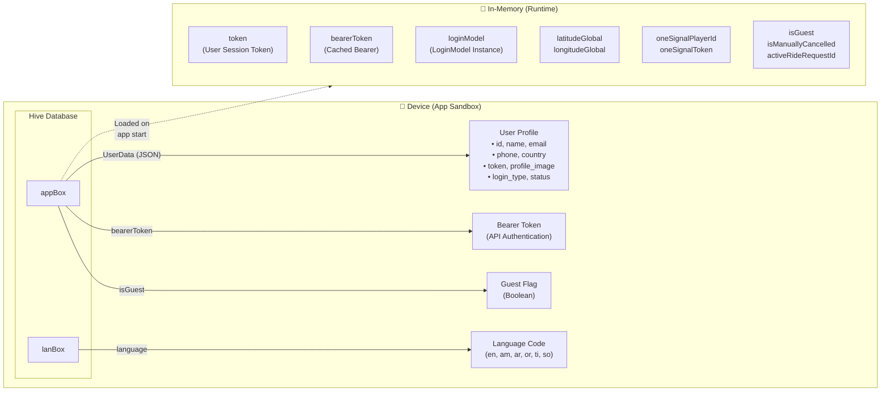

```mermaid
flowchart TB
    subgraph Android["🤖 Android Permissions"]
        A1["INTERNET"]
        A2["ACCESS_FINE_LOCATION"]
        A3["ACCESS_COARSE_LOCATION"]
        A4["READ_EXTERNAL_STORAGE"]
        A5["WRITE_EXTERNAL_STORAGE"]
        A6["ACCESS_NETWORK_STATE"]
        A7["WAKE_LOCK"]
        A8["VIBRATE"]
        A9["C2DM RECEIVE\n(Push Notifications)"]
    end

    subgraph iOS["🍎 iOS Permissions (Info.plist)"]
        I1["NSCameraUsageDescription\n→ Profile photo & ID capture"]
        I2["NSLocationWhenInUseUsageDescription\n→ Nearby rides & navigation"]
        I3["NSLocationAlwaysAndWhenInUseUsageDescription\n→ Background location updates"]
        I4["NSPhotoLibraryUsageDescription\n→ Upload ID & profile images"]
    end

    subgraph BGModes["iOS Background Modes"]
        B1["fetch"]
        B2["location"]
        B3["remote-notification"]
    end

    subgraph Usage["Feature → Permission Mapping"]
        F1["🗺️ Map & Ride Tracking"] --> A2
        F1 --> A3
        F1 --> I2
        F1 --> I3
        F2["📷 Profile Photo / ID Upload"] --> A4
        F2 --> A5
        F2 --> I1
        F2 --> I4
        F3["🔔 Push Notifications"] --> A7
        F3 --> A8
        F3 --> A9
        F3 --> B3
        F4["📍 Background Location"] --> I3
        F4 --> B2
    end
```

# Mermaid Diagrams for Mela Rider SRS

> These diagrams are formatted in Mermaid syntax. They correspond to the Software Requirements Specification (SRS) document (`Mela_Rider_SRS.md`). Each diagram includes a reference to its intended placement within the SRS document headers.

---

## 1. High-Level Data Flow Diagram
**(Belongs in SRS Section 1.4: Product Scope)**

---

## 2. Business Flow Diagram
**(Belongs in SRS Section 2.1: Product Perspective)**

---

## 3. System Architecture Diagram
**(Belongs in SRS Section 3.3: Software Interfaces)**

```mermaid
flowchart TB
    subgraph PresentationLayer["🎨 PRESENTATION LAYER"]
        direction TB
        subgraph Screens["Screens"]
            S1["Splash / Initial"]
            S2["Onboarding"]
            S3["Login"]
            S4["Signup"]
            S5["OTP Verification"]
            S6["Home"]
            S7["Search Map"]
            S8["Route Location"]
            S9["Vehicle Selection"]
            S10["Send Ride Request"]
            S11["Nearby Drivers Loading"]
            S12["Payment"]
            S13["Payment Gateway\n(WebView)"]
            S14["Payment Success"]
            S15["Ride History"]
            S16["Account / Profile"]
            S17["Email / Phone\nUpdate"]
        end
        subgraph Cubits["Cubits (BLoC State Management)"]
            C1["AuthLoginCubit"]
            C2["AuthSignUpCubit"]
            C3["AuthOtpVerifyCubit"]
            C4["GoogleLoginCubit"]
            C5["AppleLoginCubit"]
            C6["BookRideRealTimeDBCubit"]
            C7["RideRequestCubit"]
            C8["GetRideRequestStatusCubit"]
            C9["GetVehicleDataCubit"]
            C10["GetItemPriceCubit"]
            C11["LocationUserCubit"]
            C12["PaymentCubit"]
            C13["HistoryCubit"]
            C14["ReviewCubit"]
            C15["ReferralCubit"]
            C16["GeneralCubit"]
            C17["LanguageCubit"]
            C18["BannerCubit"]
            C19["LogoutCubit"]
            C20["SosCubit"]
        end
        subgraph Widgets["Reusable Widgets"]
            W1["Common Widgets\n(common_widget.dart)"]
        end
    end

    subgraph DomainLayer["📦 DOMAIN LAYER"]
        subgraph Entities["Entities (Data Models)"]
            E1["LoginModel"]
            E2["CategoryModel"]
            E3["RideRequestModel"]
            E4["BookingSuccess"]
            E5["DriverData"]
            E6["HistoryData"]
            E7["GeneralData"]
            E8["GetItemPrice"]
            E9["BannerModel"]
            E10["ReferralModel"]
            E11["ReferralDiscount"]
            E12["SOSData"]
            E13["CheckEmail"]
            E14["CheckMobile"]
            E15["StaticData"]
        end
    end

    subgraph DataLayer["💾 DATA LAYER"]
        subgraph Repos["Repositories"]
            R1["AuthRepository"]
            R2["VehicleRepository"]
            R3["PaymentRepository"]
            R4["ProfileRepository"]
            R5["HistoryRepository"]
            R6["ReviewRepository"]
            R7["ReferralRepository"]
            R8["BannerRepository"]
        end
        subgraph Core["Core Services"]
            CS1["HTTP Client\n(http.dart)"]
            CS2["Config\n(config.dart)"]
            CS3["DataStore\n(Hive)"]
            CS4["Push Notifications\n(OneSignal + FCM)"]
        end
    end

    Screens --> Cubits
    Cubits --> Entities
    Cubits --> Repos
    Repos --> Core
```

---

## 4. Database Entity Relationship Diagram
**(Belongs in SRS Section 5.2: Server Database & API Mapping)**

---

## 5. Authentication Flow Diagram
**(Belongs in SRS Section 4.1: Authentication & Authorization)**

---

## 6. Ride Booking Data Flow (Detailed)
**(Belongs in SRS Section 4.2: Ride Booking & Dispatch)**

---

## 7. Threat Model Mapping (STRIDE)
**(Belongs in SRS Section 6.3: Security Requirements)**

---

## 8. Push Notification Flow
**(Belongs in SRS Section 4.10: Push Notifications)**

---

## 9. Local Data Storage Diagram
**(Belongs in SRS Section 5.1: Local Storage Strategy)**

---

## 10. Android & iOS Permission Model
**(Belongs in SRS Section 6.3: Security Requirements)**

