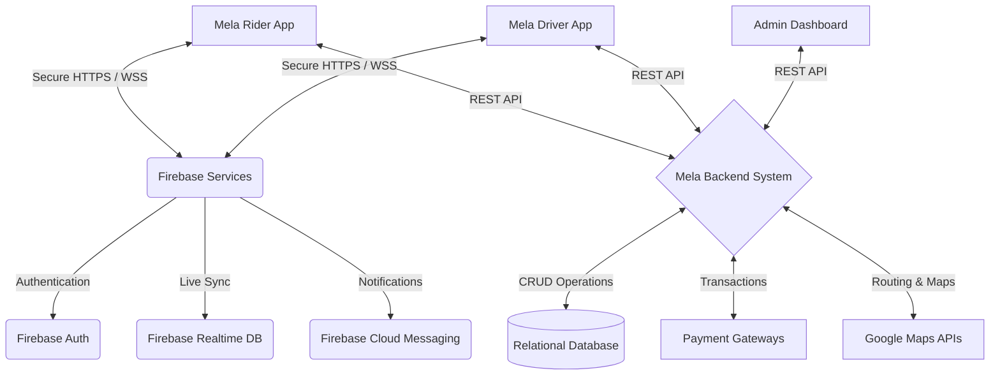
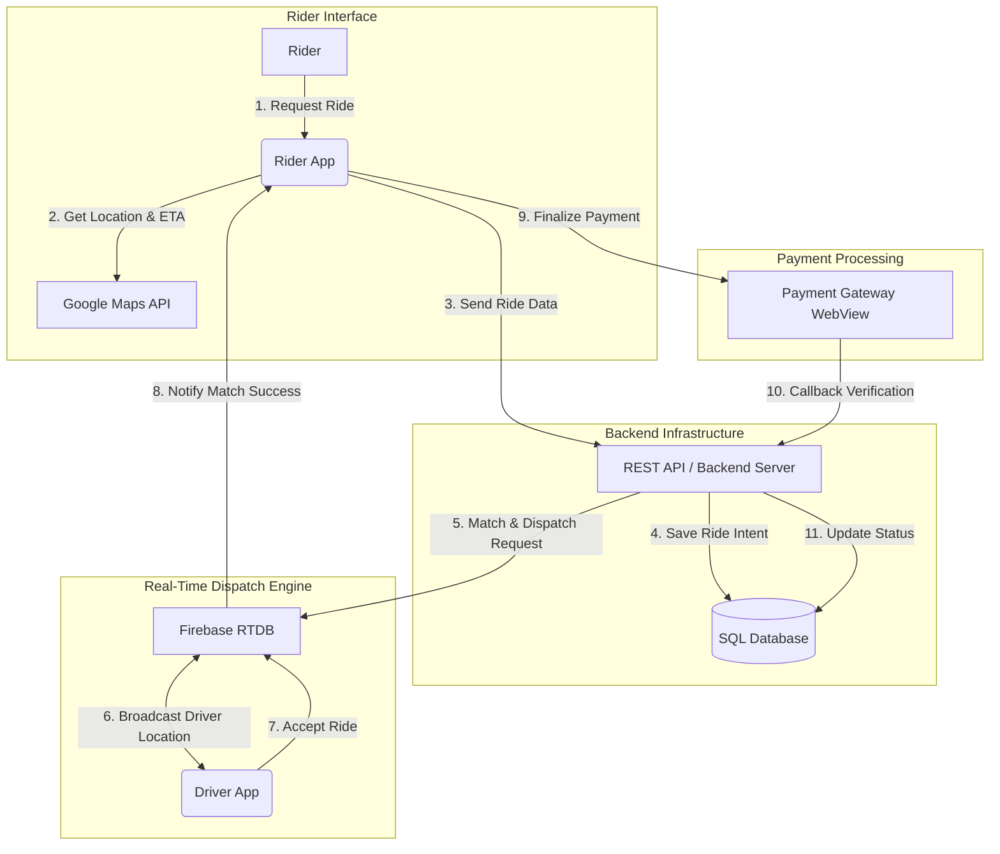
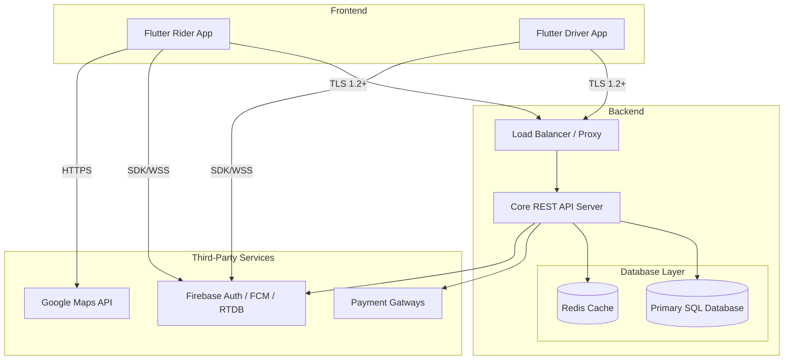
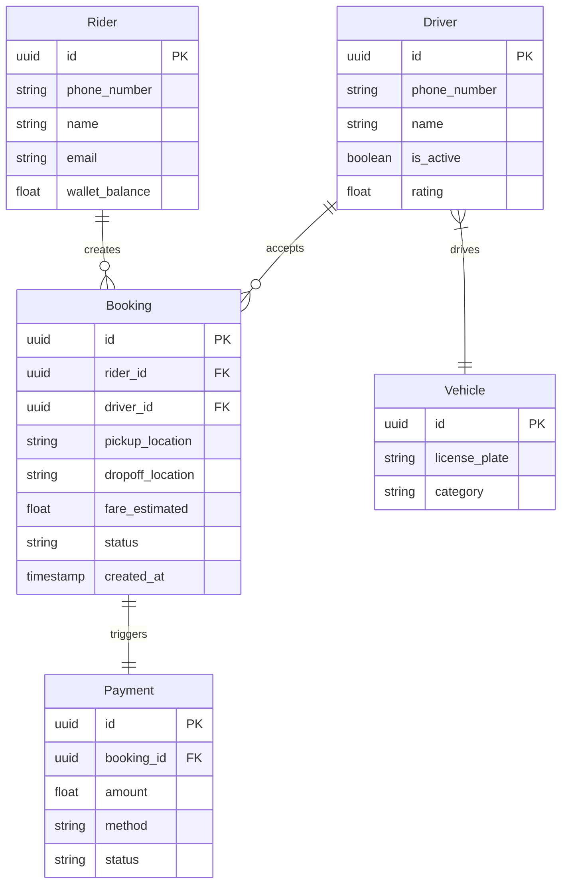
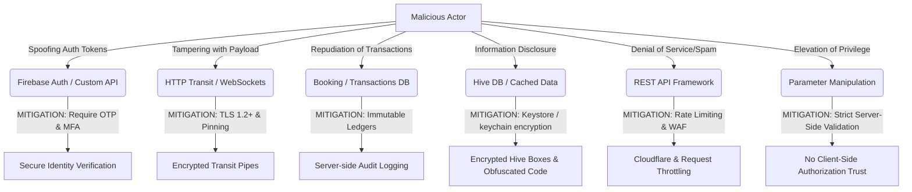
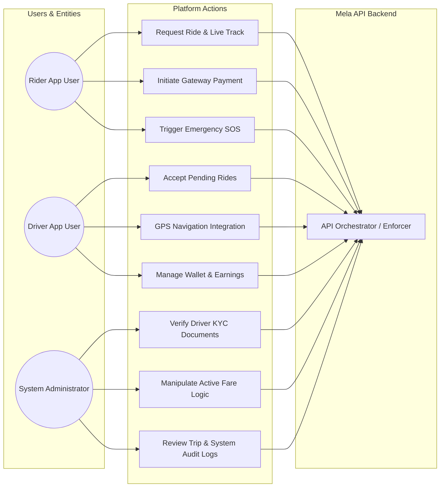

# Mela Rider Application - Cybersecurity Audit Diagrams

As requested for the INSA Mobile Application Security Testing Requirements Document (Document No: OF/AEAD/001), the following diagrams map out the core architecture, data flow, structure, and threat models of the "Mela for Mekedonia" Rider Application.

---

## 1. Business Architecture and Design Diagram (Ecosystem)
This diagram illustrates the high-level business ecosystem, showing how the Rider App interacts with other components of the platform like the Driver App, Backend Server, Firebase, and third-party APIs.

---

## 2. Data Flow Diagram
This shows the logical flow of data from the initial user request to backend processing, matchmaking via real-time databases, and payment confirmation.

---

## 3. System Architecture Diagram with Database Relation
This section covers both the topological system architecture layout and the ERD (Entity Relationship Diagram) of the core underlying database models.

### System Infrastructure

### Database Entity Relationship Diagram

---

## 4. Threat Model Mapping
Using the STRIDE framework, this highlights primary attack vectors against the mobile application endpoints and their corresponding server-side & client-side mitigations.

---

## 5. Role / System Actor Relationship
Defines the boundary relationships and use cases accessible to the differing classes of authenticated entities within the system.

